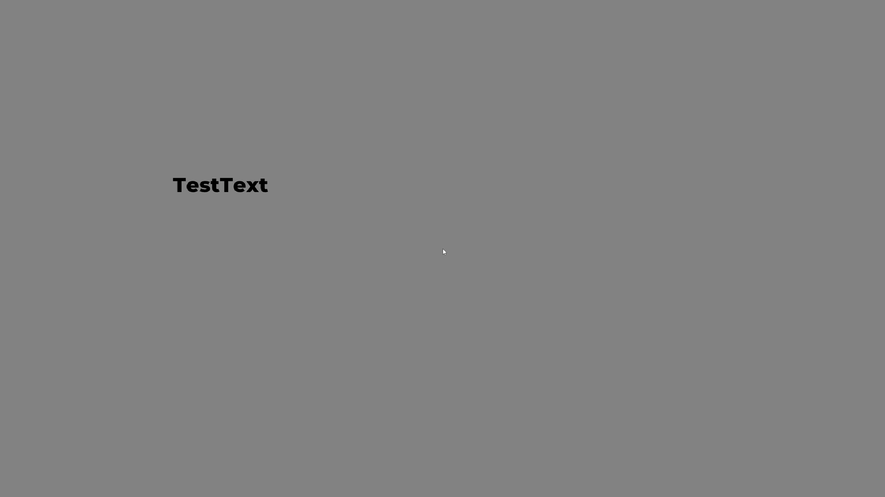
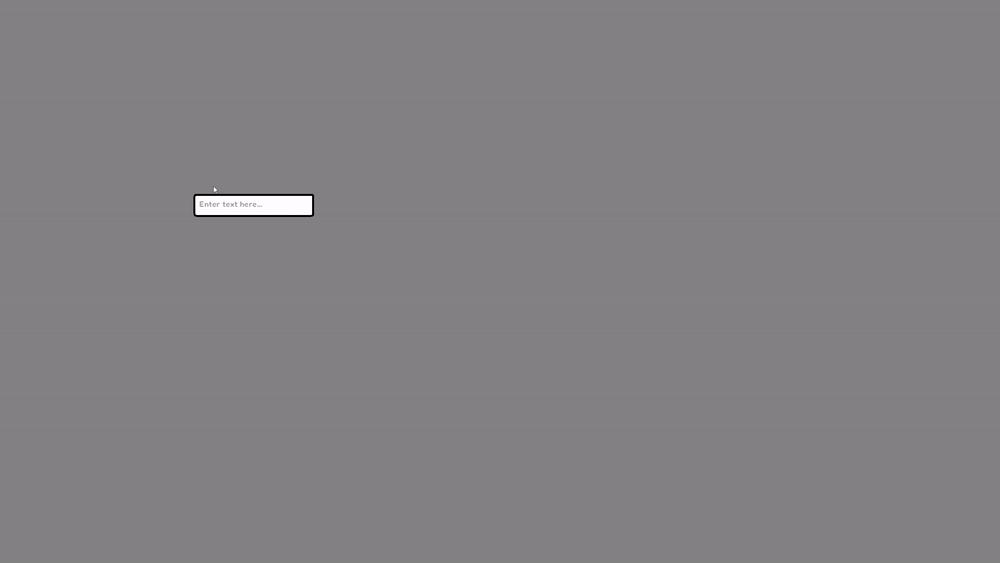
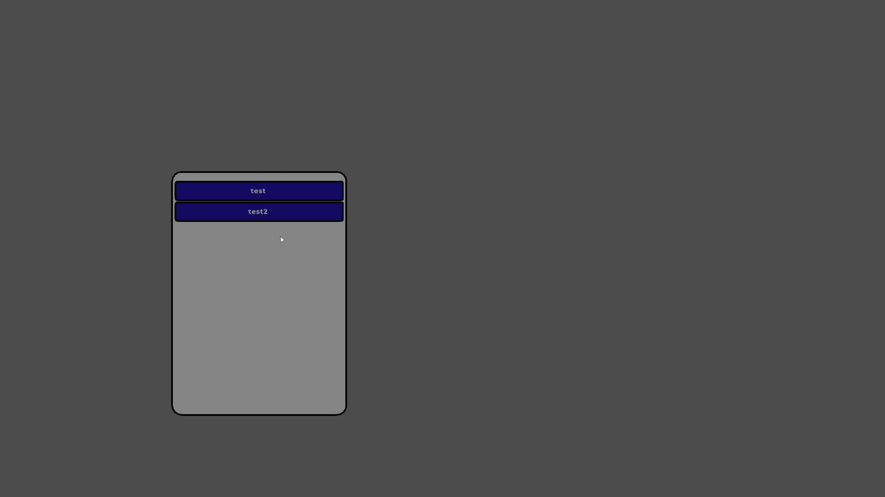
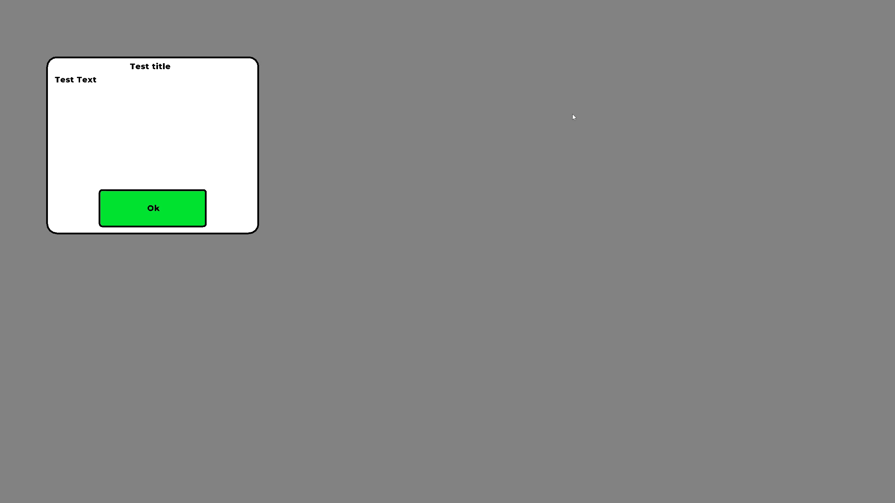

## ReImagined Engine 2D
* ReImagined Engine 2D is based off of Imagine Engine Ultimate 2D
* Built for performance and simplicity with python
* Built off of raylib
* Comes with a GUI wrapper
* Zero Generative-AI content
* Tweening system

## ⚠ BEFORE YOU READ ⚠
**PLEASE** make sure you understand raylib before you use this project.

[Raylib Documentation](https://www.raylib.com/cheatsheet/cheatsheet.html)

**HUGE** credit to the raylib devs, please check it out. Seriously, it's an amazing framework.

Another **HUGE** credit to the pyray developers as well; they made this possible and they did one amazing job at porting raylib to python.

On that note, lets continue to the rest of the documentation.

## UI Elements

To see the actual source code for the elements, go into the UI folder.

# Buttons
`Button = Button()` 
**BOOM!** You have just created a button, obviously you can customise it but just like that you have a nice-looking button on your screen.


**Want a better button?**


`test_button = Button(x=test_frame.x + (test_frame.width - 300) / 2, y=test_frame.y + 50, animation_growth_size=1, font_size=36, font_path=FontHelper.GetFontPath("Fredoka-SemiBold.ttf"), text="Play")` 


# Button Behaviour


**Incredible!** Just like that you have a good looking play button! Obviously, the button doesn't come with the frame but I added that just to help you visualise it.

# Full code for the scene

```
from pyray import *
from config import *
from UI.button import *
from UI.frame import *
from UI.font_helper import *
from Utilities.timer import *
from Utilities.window_funcs import *
from Utilities.actor import *

init_window(Game.WIDTH, Game.HEIGHT, Game.TITLE)
set_target_fps(120)
toggle_fullscreen()


test_frame = Frame(x=(get_screen_width() - 500) / 2, y=(get_screen_height() - 500) / 2)
test_button = Button(x=test_frame.x + (test_frame.width - 300) / 2, y=test_frame.y + 50, animation_growth_size=1, font_size=36, font_path=FontHelper.GetFontPath("Fredoka-SemiBold.ttf"), text="Play")
test_actor = Actor("aaron-wilder", 500, 500)

fredoka = FontHelper.LoadFont("Fredoka-SemiBold.ttf")

while not window_should_close():
    Game.dt = get_frame_time()

    begin_drawing()

    test_frame.draw()
    test_button.draw()


    end_drawing()
    
close_window()

```

Now, by adding a command parameter you can make the button actually do something!

`test_button = Button(x=test_frame.x + (test_frame.width - 300) / 2, y=test_frame.y + 50, animation_growth_size=1, font_size=36, font_path=FontHelper.GetFontPath("Fredoka-SemiBold.ttf"), text="Play", command=lambda: draw_text("Pressed!", 200, 200, 36, RED))`


# Frames

Frames are incredibly self explanatory and really easy to make.

`test_frame = Frame(x=(get_screen_width() - 500) / 2, y=(get_screen_height() - 500) / 2)`

Just look at that! You have a frame with 2 lines of code (not forgetting the .draw() for it in the render loop)


(The frame only looks grey because Windows kept bugging when I tried to screenshot it)

# Text Labels

Pretty simple. It's text for crying out loud

`test_text = Text(x=500, y=500, text="TestText", font_size=72)`




# Sliders

Sliders were a pain to make, but now they look smooth and really nice.
Same as always, its just 2 lines of code!

`test_slider = Slider(x=(Configuration.WIDTH - 300) / 2, y=(Configuration.HEIGHT - 50) / 2)`

(Don't forget the .draw in the render loop!)

Now you have a cool slider for settings! It also has a .value so you can extract that for configs!


# Textboxes

Textboxes were actually pretty easy to make in raylib over pygame.
They still need some implementations to make it foolproof but it works for now!

`test_tb = TextBox(x=500, y=500)`



You can actually change what the inside of the textbox says.
It says "Enter Text Here..." now but let's change it to "Enter username here..."

`test_tb = TextBox(x=500, y=500, text="Enter username here...")`

Easy, just like that!
(Don't forget the .draw() in the render loop!)

# Listboxes

Listboxes are **INCREDIBLE**, they're one of my most favourite things about this framework.
If you have the time, please check out the code for them, I am really proud of myself for coding it.

Anyways, listboxes (once again) are pretty simple.

Listboxes have a selected_item attribute so if you feel the need to, use it!

```
test_listbox = Listbox(x=500, y=500)
test_listbox.add_element("item1")
test_listbox.add_element("item2")
```
(Don't forget the .draw() in the render loop!)


(Colours are off due to a bug in Windows)

# Message boxes

Messageboxes look so cool and are very versatile.
You can drag them around, but if you feel the need; you make them undraggable

```
test_msg_box = MessageBox(title="Test title", message="Test Text")
```


(Once agin, Do NOT forget the .draw())


## Utilities