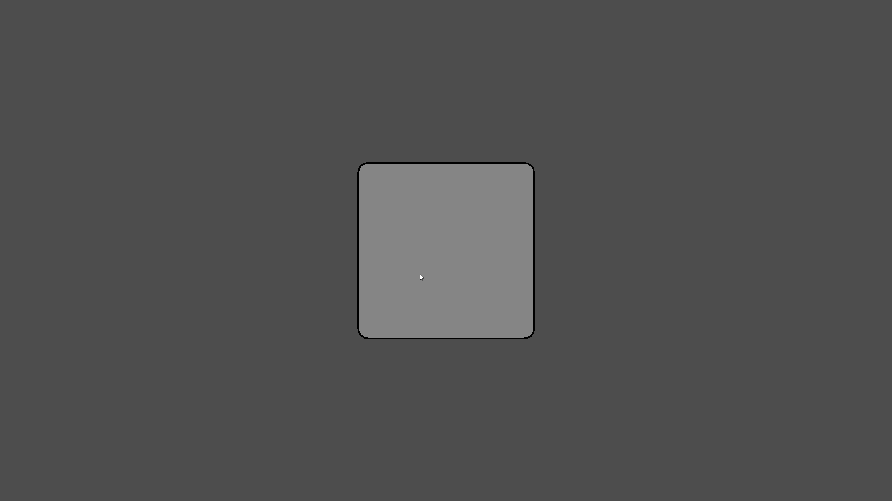

## ReImagined Engine 2D
* ReImagined Engine 2D is based off of Imagine Engine Ultimate 2D
* Built for performance and simplicity with python
* Built off of raylib
* Comes with a GUI wrapper
* Zero Generative-AI content
* Tweening system

## ⚠ BEFORE YOU READ ⚠
**PLEASE** make sure you understand raylib before you use this project. For text labels, just use draw_text or draw_text_ex.

[Raylib Documentation](https://www.raylib.com/cheatsheet/cheatsheet.html)

**HUGE** credit to the raylib devs, please check it out. Seriously, it's an amazing framework.

Another **HUGE** credit to the pyray developers as well; they made this possible and they did one amazing job at porting raylib to python.

Just to save you some time if you only don't understand text labels look here:

The order is: Font, Text, Position, Font Size, Letter Spacing and Colour

`draw_text_ex(FontHelper.GetFontPath("Fredoka-SemiBold.ttf"), "Test", Vector2(20, 20), 14, 1.0, RED)`

**IT MUST GO IN THAT ORDER!!** Anything else and it crashes.

On that note, lets continue to the rest of the documentation.

###UI Elements

To see the actual source code for the elements, go into the UI folder.

# Buttons
`Button = Button()` 
**BOOM!** You have just created a button, obviously you can customise it but just like that you have a nice-looking button on your screen.


**Want a better button?**


`test_button = Button(x=test_frame.x + (test_frame.width - 300) / 2, y=test_frame.y + 50, animation_growth_size=1, font_size=36, font_path=FontHelper.GetFontPath("Fredoka-SemiBold.ttf"), text="Play")` 


# Button Behaviour


**Incredible!** Just like that you have a good looking play button! Obviously, the button doesn't come with the frame but I added that just to help you visualise it.

# Full code for the scene

```
from pyray import *
from config import *
from UI.button import *
from UI.frame import *
from UI.font_helper import *
from Utilities.timer import *
from Utilities.window_funcs import *
from Utilities.actor import *

init_window(Configuration.WIDTH, Configuration.HEIGHT, Configuration.TITLE)
set_target_fps(120)
toggle_fullscreen()


test_frame = Frame(x=(get_screen_width() - 500) / 2, y=(get_screen_height() - 500) / 2)
test_button = Button(x=test_frame.x + (test_frame.width - 300) / 2, y=test_frame.y + 50, animation_growth_size=1, font_size=36, font_path=FontHelper.GetFontPath("Fredoka-SemiBold.ttf"), text="Play")
test_actor = Actor("aaron-wilder", 500, 500)

fredoka = FontHelper.LoadFont("Fredoka-SemiBold.ttf")

while not window_should_close():
    Configuration.dt = get_frame_time()

    begin_drawing()

    test_frame.draw()
    test_button.draw()


    end_drawing()
    
close_window()

```

Now, by adding a command parameter you can make the button actually do something!

`test_button = Button(x=test_frame.x + (test_frame.width - 300) / 2, y=test_frame.y + 50, animation_growth_size=1, font_size=36, font_path=FontHelper.GetFontPath("Fredoka-SemiBold.ttf"), text="Play", command=lambda: draw_text("Pressed!", 200, 200, 36, RED))`


# Frames

Frames are incredibly self explanatory and really easy to make.

`test_frame = Frame(x=(get_screen_width() - 500) / 2, y=(get_screen_height() - 500) / 2)`

Just look at that! You have a frame with 2 lines of code (not forgetting the .draw() for it in the render loop)



(The frame only looks grey because Windows kept bugging when I tried to screenshot it)


# Sliders

# Textboxes

# Checkboxes

## Utilities