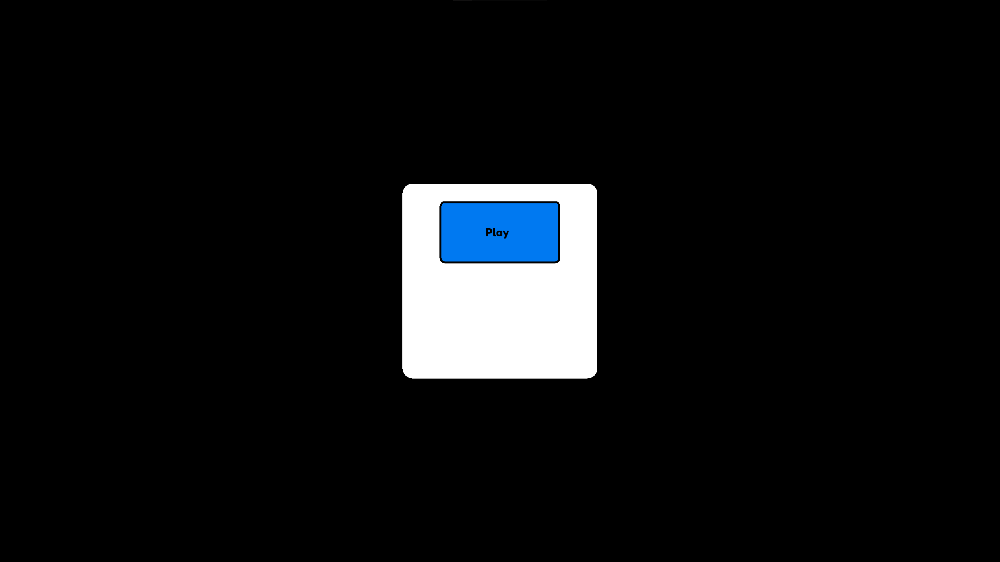
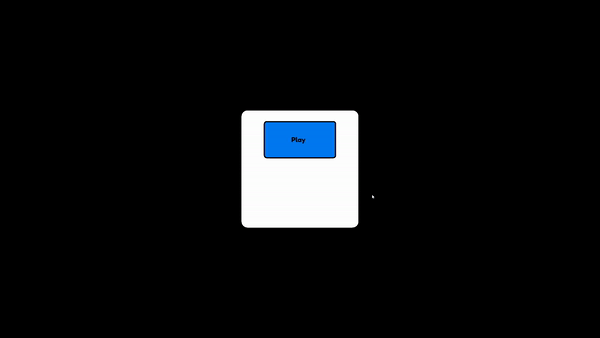

## ReImagined Engine 2D
* ReImagined Engine 2D is based off of Imagine Engine Ultimate 2D
* Built for performance and simplicity with python
* Built off of raylib
* Comes with a GUI wrapper

## Painfully easy
`Button = Button()` 
**BOOM!** You have just created a button, obviously you can customise it but just like that you have a nice-looking button on your screen.


**Want a better button?**


`test_button = Button(x=test_frame.x + (test_frame.width - 300) / 2, y=test_frame.y + 50, animation_growth_size=1, font_size=36, font_path=FontHelper.GetFontPath("Fredoka-SemiBold.ttf"), text="Play")` 



# Button Behaviour


**Incredible!** Just like that you have a good looking play button! Obviously, the button doesn't come with the frame but I added that just to help you visualise it.

# Full code for the scene

```
from pyray import *
from config import *
from UI.button import *
from UI.frame import *
from UI.font_helper import *
from Utilities.timer import *
from Utilities.window_funcs import *
from Utilities.actor import *

init_window(Configuration.WIDTH, Configuration.HEIGHT, Configuration.TITLE)
set_target_fps(120)
toggle_fullscreen()


test_frame = Frame(x=(get_screen_width() - 500) / 2, y=(get_screen_height() - 500) / 2)
test_button = Button(x=test_frame.x + (test_frame.width - 300) / 2, y=test_frame.y + 50, animation_growth_size=1, font_size=36, font_path=FontHelper.GetFontPath("Fredoka-SemiBold.ttf"), text="Play")
test_actor = Actor("aaron-wilder", 500, 500)

fredoka = FontHelper.LoadFont("Fredoka-SemiBold.ttf")

while not window_should_close():
    Configuration.dt = get_frame_time()

    begin_drawing()

    test_frame.draw()
    test_button.draw()


    end_drawing()
    
close_window()

```